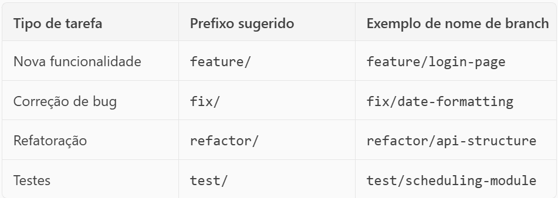
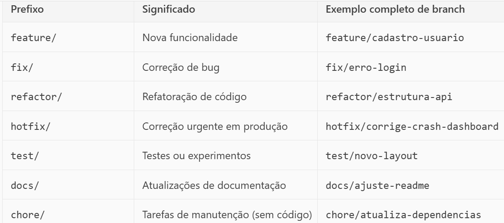

# Monitoramento e Agendamentos

Sistema fullstack para controle de agendamentos e monitoramento de atividades.

## Tecnologias

- **Frontend:** React + Vite
- **Backend:** Node.js + Express
- **Banco de Dados:** (MongoDB)

🛠️ Tecnologias Utilizadas
🔙 Backend
    Node.js: Ambiente de execução JavaScript no servidor.
    Express.js: Framework web para criação de APIs RESTful.
    MongoDB: Banco de dados NoSQL orientado a documentos.
    Mongoose: ODM (Object Data Modeling) para modelar dados do MongoDB.
    JWT (JSON Web Token): Autenticação segura baseada em tokens.
    bcryptjs: Criptografia de senhas.
    dotenv: Gerenciamento de variáveis de ambiente.
🌐 Frontend
    React.js + Vite: Biblioteca JavaScript para construção de interfaces de usuário.
    React Router DOM: Navegação entre páginas no frontend.
    Axios: Cliente HTTP para comunicação com a API.
    QRCode.react: Geração de QR Codes no frontend.
📱 Mobile (opcional)
    React Native ou Flutter: Para desenvolvimento do aplicativo móvel multiplataforma.
🧩 Funcionalidades Extras
    Leitura e geração de QR Codes: Para identificação rápida de equipamentos e acesso a funcionalidades.
    Sistema de pontos: Gamificação para incentivar o uso e o relato de problemas.
    Minimapa interativo: Navegação visual entre ambientes (a ser implementado no frontend).
🔐 Segurança
    Autenticação com JWT
    Criptografia de dados sensíveis
    Controle de acesso por perfil (usuário e administrador)

## Estrutura

monitoramento-app/ ├── frontend/ # Interface do usuário (React) ├── backend/ # API e lógica de negócios (Node.js)

## Como rodar

### Manual de criação e Gerencimento das branches

🌱 Branch Principal: main ou master
 - Contém o código estável e pronto para produção.
 - Nunca desenvolva diretamente nela.

🛠️ Quando criar uma branch?
Crie uma branch sempre que for:

 - Adicionar uma nova funcionalidade
 - Corrigir um bug
 - Trabalhar em uma melhoria visual ou estrutural
 - Fazer testes ou experimentos 

🧭 Como nomear branches?
Use nomes descritivos e padronizados. Exemplos:




🧪 Exemplo prático no seu projeto
Para o frontend:

 - git checkout -b feature/login-page

Para o backend:

 - git checkout -b feature/api-agendamentos
 
🔁 Fluxo de trabalho sugerido
Crie uma branch a partir da main:

    git checkout main
    git pull
    git checkout -b feature/nome-da-tarefa

Desenvolva normalmente.
Faça commits frequentes e descritivos:
    git add .
    git commit -m "Adiciona formulário de agendamento"

Quando terminar, faça merge com a main:
    git checkout main
    git pull
    git merge feature/nome-da-tarefa

Apague a branch se quiser:
    git branch -d feature/nome-da-tarefa

#### PASSO A PASSO

---

## 🚀 Etapas para Desenvolver seu Projeto

### 🔹 **1. Planejamento e Design**
- [ ] Refine os **requisitos funcionais** (já bem definidos no documento).
- [ ] Crie **wireframes** e **protótipos** das telas (Figma é uma boa opção).
- [ ] Modele os **dados** (equipamentos, usuários, agendamentos, relatórios).

---

### 🔹 **2. Configuração do Ambiente**
- Backend: `Node.js + Express + MongoDB`
- Frontend: `React + Vite`
- Mobile (futuramente): `React Native` ou `Flutter`

---

### 🔹 **3. Backend (API RESTful com Express)**
- [ ] **Endpoints principais**:
  - `POST /login` – autenticação
  - `GET /ambientes` – listar ambientes
  - `POST /agendamentos` – criar agendamento
  - `GET /equipamentos/:id` – dados via QR Code
  - `POST /problemas` – registrar problema
  - `GET /demandas` – (admin) visualizar demandas
- [ ] **Modelos MongoDB**:
  - Usuário, Equipamento, Ambiente, Agendamento, Problema
- [ ] **Autenticação JWT**
- [ ] **Criptografia de dados sensíveis**
- [ ] **Integração com biblioteca de QR Code** (ex: `qrcode`, `qrcode-reader`)

---

### 🔹 **4. Frontend (React + Vite)**
- [ ] **Páginas principais**:
  - Login
  - Dashboard (ambientes, equipamentos)
  - Agendamento
  - Relatório de problemas
  - Painel do administrador
- [ ] **Minimapa interativo** (pode usar SVG ou canvas)
- [ ] **Alertas visuais** (ex: ícones vermelhos para problemas)
- [ ] **Leitura de QR Code** (ex: `react-qr-reader`)

---

### 🔹 **5. Mobile App (React Native ou Flutter)**
- [ ] Leitura de QR Code
- [ ] Agendamento rápido
- [ ] Relato de problemas
- [ ] Notificações push (opcional)

---

### 🔹 **6. Testes e Validação**
- [ ] Testes unitários e de integração (Jest, Supertest)
- [ ] Testes de usabilidade
- [ ] Testes de segurança (validação de entrada, autenticação)

---

### 🔹 **7. Deploy**
- Backend: Render, Railway, Heroku, ou VPS
- Frontend: Vercel, Netlify
- Banco de dados: MongoDB Atlas
- Mobile: Play Store / App Store (futuramente)

---

### 🔹 **8. Pós-Deploy**
- [ ] Monitoramento (ex: LogRocket, Sentry)
- [ ] Sistema de pontos e sorteios (gamificação)
- [ ] Treinamento dos usuários

---

POSSÍVEIS PRÓXIMOS PASSOS:
- Criar a estrutura inicial do projeto (backend ou frontend)
- Gerar modelos MongoDB
- Criar rotas Express
- Montar o banco de dados
- Integrar QR Code


#### Frontend
```bash
cd frontend
npm install
npm run dev

#### Frontend

cd backend
npm install
node index.js

